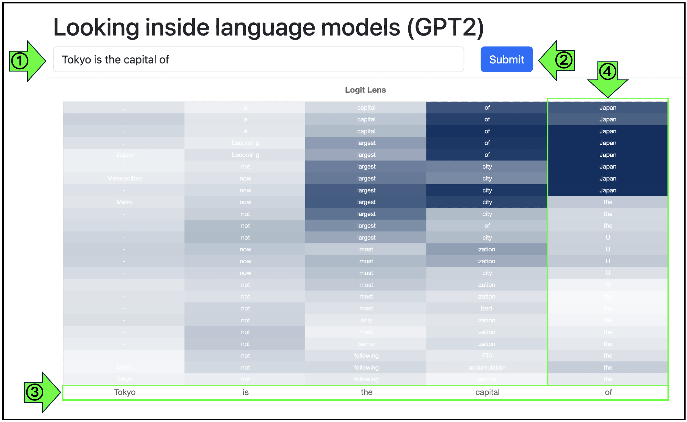

# LogitLens +α

## 使い方
#### <mark>①</mark> 画面上部のテキストボックスに、英語の文章を入力してください。
  - 例: "Tokyo is the capital of"

#### <mark>②</mark> 青い "Submit" ボタンを押します。
- 数秒待つと、結果が可視化されます。

## 見方
#### <mark>③</mark>  入力が単語 (もしくは単語よりも小さな単位) に分割されたものが表示されます。
- 世界中の単語をすべて集めることは困難です。また、新しい単語に対応するためにも、単語を分割してモデルに理解させています。
  - 例: "capitalization" は "capital" と "ization" に分割されます。
- "文字"以上 "単語"以下 の単位を、サブワードと呼びます。

#### <mark>④</mark>  次単語予測と途中経過が表示されます。
- 近年の言語モデルの多くは与えられた入力から次の単語を予測するように学習されています。
- 緑で囲まれた列は、"Tokyo is the capital of" の "of" の次の単語を予測しようとしている部分です。
  - 一つ左の列は、"capital" の次の単語を予測する過程を表しています。
- 下から "of" が与えられ、画面上方に行く毎に文脈が考慮されていきます。
- 一番上に表示されている単語が、最終的に言語モデルが予測した次の単語です。
  - 今回は正しく"Japan"と予測できています。
- 画像の上にポインタを合わせると、各Layer　(途中結果の観測地点) における最も予測確率が高い5単語が確率とともに表示されます。
  

## このアプリについて
- Logit Lens [Nostaigebraist 2020] は、Transformerモデル内部の途中結果を可視化するためのツールとして使われています。
- もともと画像出力のみでしたが、分析にほしい情報を追加するために、このアプリを作成しました。